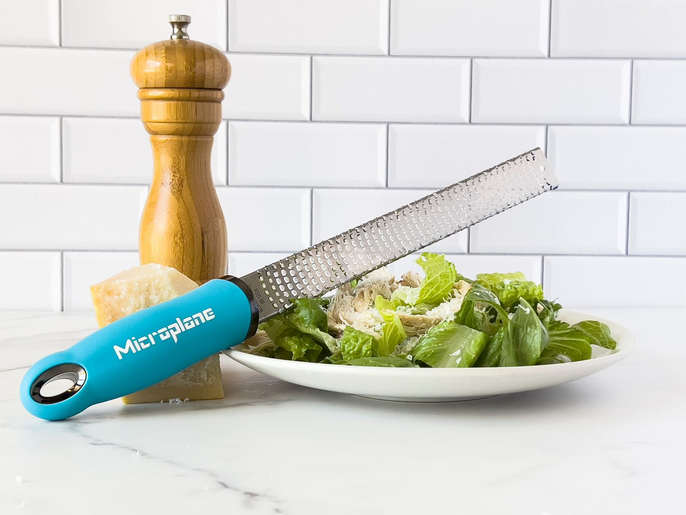

Today I made Jess Elliot Dennison's Broccoli, Parmesan and Lemon Orecchiette pasta for the third time. Two portions of this dish contains an entire head of broccoli, which is an insane quantity of broccoli to eat in a single setting: more than I would usually eat in a week!

It's from [her Midweek Recipe's book](https://www.elliottsedinburgh.com/shop/p/midweek-recipes-book-tmaah), which I can't recommend enough. The recipes it contains are simple, bold and innovative, drawing from a simple set of ingredients that I find easy to keep a stock of, so no traipsing to obscure delis in the rain at 7pm in search of rare spices I can't pronounce.

I received the book as a Christmas present from my partner and have been cooking things from it at least once a week since then, usually more often. We've both been impressed with all the recipes so far, including but not limited to: miso flatbreads (only 3 ingredients, ridiculously easy and delicious); cavolo nero pasta (so dark and mysterious); and green lentils topped with torn burrata and a salsa verde so tasty that I genuinely struggle not to eat it all in one go with a spoon.

Each recipe has given me a new appreciation for certain ingredients that I either hadn't used before or had been neglecting with my ignorance until then. For example, **lemons** crop up in the large majority of the book's savoury recipes, to the point where I was finding it ridiculous on my first skim read: how good can sour, seed-filled lemons really be? Surely not so good that you'd put them in basically *all* of your food? Little did smug past-me know how much life a sprinkle of zest and a splash of lemon juice can bring to a dish! After trying a variety of Jess' recipes, my passion for lemons has now escalated to the point where I have now purchased a microplane specifically to maximise my per-lemon zest yield and I get nervous if I have fewer than 4 lemons in the house.

Another example of an ingredient that this book has converted me on is broccoli. Under normal circumstances, if you were to ask me if I wanted to an entire head of broccoli for dinner, regardless of what it was accompanied with, I would likely politely decline and make subtle but concerned inquiries as to your mental health. However, after a few attempts at her broccoli pasta dish, Ms Dennison has me converted into a full-blown broccoli bandit boiling multiple heads of the green stuff into saucy submission on a rainy Sunday night!

In summary: Midweek Recipes is a great book and I'm looking forward to unleashing the potential of other underappreciated ingredients that are currently languishing in our kitchen 🥦
